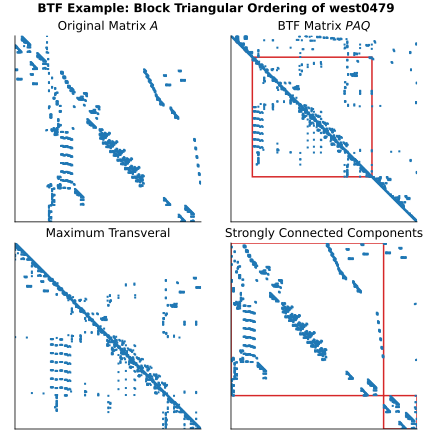

.. Copyright (C) 2025, Bernard Roesler. All rights reserved.
   Part of the scikit-sparse project.
   See pyproject.toml for full author list and LICENSE.txt for license details.
   SPDX-License-Identifier: BSD-2-Clause

Block Triangular Form (BTF) (:mod:`sksparse.btf`)
===============================================================

.. module:: sksparse.btf
   :synopsis: Block Triangular Form (BTF) permutation

.. versionadded:: 0.5.0

The :mod:`sksparse.btf` module provides efficient implementations of the
Block Triangular Form (BTF) ordering algorithm for sparse, square matrices.

It exposes the main functions of the `BTF package
<https://github.com/DrTimothyAldenDavis/SuiteSparse/tree/dev/BTF>`_, which
permutes a sparse matrix into upper block triangular form with a zero-free
diagonal, or with a maximum number of nonzeros along the diagonal if
a zero-free permutation does not exist. The BTF function accepts both real and
complex matrices, in any format supported by :mod:`scipy.sparse` (CSC format is
most efficient).

Quickstart
----------

If :math:`A` is a sparse, square matrix, then the
following code computes the AMD ordering of :math:`A`:

.. code:: python

    from sksparse.btf import btf
    A = ...  # some sparse matrix
    p, q, r = btf(A)
    PAQ = A[p][:, q]

to give the permuted matrix :math:`PAQ`, where :math:`P` is the permutation
matrix corresponding to the ordering :math:`p`, and similarly for :math:`q`. If
:math:`A` is structurally singular, then the permutation vector `q` will have
negative entries denoting the unmatched indices. To get the actual permutation,
use

.. code:: python 

   import numpy as np
   from sksparse.btf import btf_q_permutation
   q_idx = np.nonzero(q < 0)[0]  # store the indices of negative entries
   q = btf_q_permutation(q)      # get the permutation vector
   PAQ = A[p][:, q]              # permute the matrix

Top-level Functions
-------------------

The main function this module provides is :func:`btf`.

.. autofunction:: btf

Internally, the :func:`btf` function uses a combination of the following:

.. autofunction:: maxtrans
   
.. autofunction:: strongcomp

They are exposed for advanced use cases, but typically you will not need to
call them directly.

Convenience Methods
-------------------

The BTF package also provides a convenience function to get the actual ``q``
permutation vector:

.. autofunction:: btf_q_permutation

Example
-------

This figure shows the effect of BTF ordering:

The source code for this example is:

.. literalinclude:: examples/btf_example.py
   :language: python
