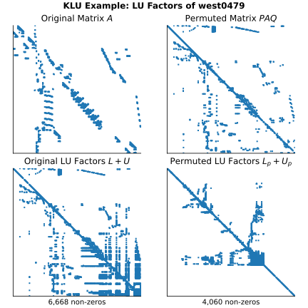

=================================================
Clark Kent LU Decomposition (:mod:`sksparse.klu`)
=================================================

.. currentmodule:: sksparse.klu

The :mod:`sksparse.klu` module provides an interface to the SuiteSparse
`KLU <klu_github_>`_ package, which computes basic linear algebra
operations for sparse, square matrices.

The main function of this module is to compute the `LU factorization
<LU_wiki_>`_ of a sparse matrix :math:`A` with a fill-reducing permutation
:math:`P` and :math:`Q`, and row-scaling :math:`R`, and offset :math:`F` such
that:

.. math::

    LU + F = RPAQ.

These factors can then be used to solve linear systems of the form
:math:`Ax = b`.

The :mod:`.klu` module exposes most of the capabilities of the KLU
package including:

* Computation of the LU factors with fill-reducing
  permutation for both real and complex sparse matrices :math:`A`, in any
  format supported by :mod:`scipy.sparse`.
* An interface for using this decomposition to solve problems of the form
  :math:`Ax = b`.
* The ability to perform the fill-reduction analysis once, and then
  re-use it to efficiently decompose many matrices with the same pattern of
  non-zero entries.

.. _klu_github: https://github.com/DrTimothyAldenDavis/SuiteSparse/tree/dev/KLU
.. _LU_wiki: https://en.wikipedia.org/wiki/LU_decomposition

Quickstart
----------

If :math:`A` is a sparse matrix then the
following code computes the LU decomposition of :math:`A`:

.. code:: python

  from sksparse.klu import klu_factor
  L, U, p, q, r, F, _ = klu_factor(A)
  # L @ U + F == r[:, np.newaxis] * A[p[:, np.newaxis], q]

See the :ref:`example <klu-example>` below for a demonstration of the
effect of the fill-reducing permutation.

Once the factorization has been computed, it can be used to solve a square
linear system:

.. code:: python

  from sksparse.klu import klu_factor
  A = ...  # a sparse, square matrix
  b = ...  # right-hand side
  x = klu_solve(A, b)

.. _klu-example:

Example
-------

To see how to use the LU factorization, we can load a sparse matrix
from the `SuiteSparse Matrix Collection <SSMC_>`_ and compute its ordering.

.. _SSMC: https://sparse.tamu.edu

.. literalinclude:: examples/klu_example.py
   :language: python

This figure shows the effect of AMD ordering that reduces the fill-in of the
LU factorization of a sparse matrix.

   The number of non-zeros in the LU factorization of the original matrix
   (left) and the permuted matrix (right) using AMD ordering.

Function Interface
------------------

For users who want to directly compute the factorization without needing to
manipulate the :class:`KLUFactor` object, the :mod:`.klu` module
provides the :func:`klu_factor` function that performs both the
symbolic analysis and the numeric factorization in one step. It returns the
factorization object as a single output, or the individual factors and
permutations can be unpacked as multiple outputs.

To directly solve a linear system without explicitly computing the
factorization, the :func:`klu_solve` function can be used. This function
performs the factorization internally and returns the solution to the linear
system.

Object Interface
----------------

For more advanced usage, users can instantiate the :class:`KLUFactor`
class. This class can be instantiated directly using its constructor, or more
conveniently using the :func:`klu_factor` function.

When instantiated directly, the constructor performs a symbolic analysis of the
matrix, but does not compute the numeric factorization. The numeric
factorization is then performed by calling the :meth:`.KLUFactor.factorize`
method.

The :func:`klu_factor` function performs both the symbolic analysis and the
numeric factorization in one step, and returns an instance of the
:class:`KLUFactor` class. The resulting :class:`KLUFactor` object can then be
used to solve linear systems using its :meth:`KLUFactor.solve` method. The
:meth:`KLUFactor.factorize` method can be called again to factor a new matrix
with the same sparsity pattern.

Customization and Statistics
++++++++++++++++++++++++++++

The :func:`klu_factor` accepts several optional parameters that control the
behavior of the factorization, such as the fill-reducing ordering method to
use. The :class:`KLUControl` object can be instantiated directly to customize
the factorization options before passing it to the :class:`KLUFactor`
constructor or the :func:`klu_factor` function. Any options not explicitly set
by the user will be given the KLU default values.

After a factorization is computed, statistics about the factorization can be
accessed via the :attr:`KLUFactor.info` attribute, which is an instance of
the :class:`KLUInfo` class. This object contains various performance metrics
and statistics about the factorization process.

Exceptions and Warnings
-----------------------

Warnings issued by KLU are converted into Python warnings of
type :exc:`KLUWarning`. The module will also issue
a :exc:`~scipy.sparse.SparseEfficiencyWarning` if the input matrix is not
a :class:`~scipy.sparse.csc_array` (note that the
:class:`~scipy.sparse.csc_matrix` class is not supported, as it will be
deprecated and is not recommended for use in new code).

Errors detected by KLU or by our wrapper code are converted into exceptions
of type :exc:`KLUError` or an appropriate subclass. See the
:ref:`klu-exceptions` for details.
